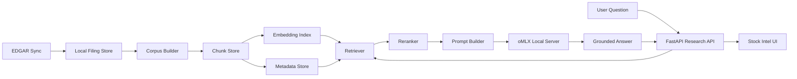

# EDGAR Qwen3.6 Local Intelligence Architecture Spec

Prepared 2026-04-26.

## Status

Proposed architecture spec for adding local filing analysis on top of the simplified EDGAR sync and cache architecture.

## Summary

This spec defines a local-first research architecture that:

- keeps the simplified SEC EDGAR sync and raw filing acquisition layer as the source-of-truth substrate
- parses locally saved filing artifacts into a searchable filing corpus
- retrieves relevant filing chunks for a user question
- sends only the retrieved local chunks to a local MLX model
- returns grounded answers with explicit filing citations

This document is the intelligence-layer companion to:

- `docs/edgar-tool-simplification-and-cache-spec.md`

Boundary:

- the EDGAR tool simplification spec owns issuer resolution UX, sync behavior, and cache policy
- this spec owns corpus extraction, indexing, retrieval, prompt construction, and local answer generation

The recommended default runtime is:

- local inference server: `oMLX`
- generation model: `mlx-community/Qwen3.6-35B-A3B-4bit`
- embedding model: `mlx-community/nomicai-modernbert-embed-base-4bit`
- reranker model: `mlx-community/Qwen3-Reranker-0.6B-mxfp8`

Reranker model decision record:

- the original candidate was `mlx-community/mxbai-rerank-large-v2`
- local oMLX smoke testing rejected that artifact on `/v1/rerank` with `400`
- the downloaded MLX artifact advertises `architectures: ["Qwen2ForCausalLM"]` and is discovered by oMLX as a text-generation model, not a reranker engine
- the Hugging Face artifact is labeled as text generation and documents `mlx_lm.generate(...)` usage, which does not match the oMLX reranker endpoint contract
- `mlx-community/Qwen3-Reranker-0.6B-mxfp8` is accepted by oMLX as a reranker engine and passed a basic relevance smoke test
- this is a phase 1 compatibility decision, not a claim that Qwen3-Reranker-0.6B is higher quality than `mxbai-rerank-large-v2`
- if answer quality or retrieval ordering becomes a bottleneck, revisit this decision and either find an oMLX-compatible higher-quality reranker or implement a custom Qwen2 causal-LM reranker scoring path for `mxbai-rerank-large-v2`

This spec assumes the current desktop app shape stays intact:

- Tauri remains a thin shell
- FastAPI remains the application backend
- the backend owns data orchestration
- the frontend owns workflow UI only

## Why This Spec Exists

The repo already has the hard part of local research acquisition:

- EDGAR sync writes raw filing files under `[ticker workspace root]/stocks/[ticker]/`
- EDGAR machine state and exports already live under `[ticker workspace root]/stocks/[ticker]/.edgar/`
- the desktop app already launches a local FastAPI backend

What is missing is the intelligence layer between:

- raw filing files on disk
- a local model that can answer filing questions

This spec exists to prevent three bad outcomes:

- bolting an LLM directly into the UI with no grounded retrieval
- treating filing Q and A as one giant prompt instead of a document system
- mixing local model concerns into the EDGAR downloader itself

## Product Goal

From `Stock Intel > EDGAR Filings`, the user should be able to ask questions like:

- "What changed in risk factors versus the prior 10-K?"
- "Summarize the last three 8-Ks about guidance or supply chain."
- "What does management say about gross margin pressure?"
- "Which sections mention inventory, working capital, or customer concentration?"

The answer must:

- run locally
- cite the exact filing and section used
- stay grounded in retrieved filing text
- work even when the internet is unavailable after sync is complete

## Non-Goals

This spec does not attempt to:

- make the local model a general web search agent
- replace the raw EDGAR downloader with a cloud pipeline
- push the full filing corpus into one prompt
- guarantee frontier-level factual recall without retrieval
- fine-tune a custom financial model in phase 1
- cache generated filing answers in phase 1

## Hardware Target

Primary target:

- Apple Silicon Mac
- `M3 Pro`
- `36 GB` unified memory
- large local SSD headroom

Implications:

- `Qwen3.6-35B-A3B-4bit` is the high-end local target, but should be treated as memory-sensitive
- `Qwen3.5-27B-4bit` remains the fallback generation model when reliability matters more than peak capability
- chunk retrieval and reranking are mandatory because long-context brute force is not practical on this machine

## Chosen Runtime

### Default Runner

Use `oMLX` as the default local model server.

Why:

- Apple Silicon focused
- serves MLX models directly
- exposes OpenAI-compatible and Anthropic-compatible APIs
- supports embeddings and reranking in the same server
- is explicitly designed for long-context agent-style workloads with SSD KV cache reuse

`oMLX` is an implementation detail, not a frontend concern.

The app should talk only to a local backend-owned inference client.

### Default Models

Generation:

- `mlx-community/Qwen3.6-35B-A3B-4bit`

Embedding:

- `mlx-community/nomicai-modernbert-embed-base-4bit`

Reranker:

- `mlx-community/Qwen3-Reranker-0.6B-mxfp8`

Fallback generation model:

- `mlx-community/Qwen3.5-27B-4bit`

### Why Qwen3.6 35B A3B

For the current local target, `Qwen3.6-35B-A3B` is the best stretch model because it combines:

- strong current open-weight reasoning performance
- `262k` context on the base model family
- Apache 2.0 licensing
- existing MLX conversions

This model should not be trusted to answer from parametric memory alone.
It must be paired with retrieval and citations.

Operational rule:

- if the `Qwen3.6-35B-A3B-4bit` path shows unstable latency, swap pressure, or repeated load failures on the target Mac, the implementation must fall back to `Qwen3.5-27B-4bit` without changing the rest of the architecture

## Existing System Constraints

Current repo constraints that this design must preserve:

- `src/investing_platform/services/edgar.py` owns SEC sync and raw artifact download
- `src/investing_platform/api/routes/research.py` owns EDGAR research routes
- `frontend/src/lib/api/sources.ts` owns EDGAR client calls
- `frontend/src/features/stock-intel` owns Stock Intel orchestration
- `frontend/src-tauri/src/lib.rs` remains a thin launcher for the Python backend

The EDGAR intelligence layer must sit beside the downloader, not inside it.

## Architecture Overview



## Question Execution Flow

This section makes explicit how the model is engaged when the user asks a filing question.

1. the user asks a question from the ticker’s EDGAR workspace
2. the frontend sends the ticker context and question to the backend ask route
3. the backend checks ticker freshness and index readiness
4. if the ticker is stale, the backend runs a bounded incremental EDGAR refresh according to `docs/edgar-tool-simplification-and-cache-spec.md`
5. the backend downloads any newly required raw filing bodies for unseen accession numbers
6. the backend updates the ticker-scoped corpus and embedding index only for new or changed documents
7. the retriever embeds the question and searches the ticker-scoped filing corpus
8. the reranker selects the best prompt-ready chunks
9. the prompt builder assembles a grounded filing-only prompt
10. the backend calls the local generation model through `oMLX`
11. the backend returns a structured answer with citations, limitations, and confidence

Important rules:

- the frontend never calls `oMLX` directly
- the model never reads raw EDGAR files directly from the UI layer
- retrieval happens before generation every time
- filing freshness and filing intelligence are separate checks, but they run in one backend-owned flow

## Ask-Time Work Budget

Phase 1 question answering must have hard maintenance limits so a normal question cannot turn into an unbounded sync or indexing job.

Ask-time incremental maintenance budget:

- maximum wall-clock budget before retrieval starts: `30s`
- maximum live EDGAR metadata refresh calls: `1` issuer submissions refresh
- maximum newly downloaded filing bodies: `5`
- maximum newly indexed primary documents: `5`
- maximum embedding chunks generated inline: `250`
- maximum inline index build time: `20s`
- maximum local model generation time: `60s`

Fallback behavior:

- if the metadata live check fails but a usable local workspace exists, continue with stale or degraded freshness metadata and include a `freshness` limitation in the answer
- if more than `5` filing bodies are newly required, download and index the newest `5` eligible primary documents inline, queue the remainder for background indexing, and set `maintenanceState.status` to `partial`
- if inline indexing exceeds `20s`, stop adding new documents, answer from the last ready index when possible, and return `maintenanceState.status: "deferred"`
- if no ready index exists after the budget is exhausted, return `409` with `code: "index_not_ready"` and include the queued `jobId`
- if the question is explicitly freshness-sensitive, such as asking about "today", "latest", "new filing", or "recent 8-K", and the live check fails, return `409` with `code: "freshness_unavailable"` unless the user explicitly allows stale answers

These budgets are phase 1 defaults, not user preferences. They can become settings later, but the API contract should not depend on unbounded work.

## Component Boundaries

### 1. EDGAR Acquisition Layer

Owner:

- `src/investing_platform/services/edgar.py`

Responsibilities:

- resolve issuer
- fetch SEC metadata
- download filing files
- preserve raw SEC artifacts exactly as served
- write exports and manifests

Non-responsibilities:

- text extraction
- chunking
- embeddings
- prompt construction
- question answering

Rule:

The intelligence layer may read EDGAR output, but it may not change raw EDGAR artifacts.

### 2. Filing Corpus Builder

New backend service:

- `src/investing_platform/services/edgar_intelligence.py`

Sub-responsibilities:

- discover locally synced filing files for a ticker
- choose which files are eligible for parsing
- extract normalized text from filing documents
- build section-aware chunks
- persist derived chunk metadata

Recommended helper split:

- `services/edgar_corpus.py`: corpus discovery and file eligibility
- `services/edgar_parse.py`: HTML, TXT, XML, and plain-text extraction
- `services/edgar_chunking.py`: chunk creation and section-aware splitting
- `services/omlx_client.py`: local inference, embeddings, and rerank calls

### 3. Retrieval Layer

Owner:

- backend service layer

Responsibilities:

- embed chunks
- embed query
- perform top-k semantic search
- rerank candidate chunks
- enforce grounded context limits

### 4. Answer Generation Layer

Owner:

- backend service layer through a local inference client

Responsibilities:

- build a filing-grounded prompt
- call local generation model
- require answer citations
- reject unsupported answers when retrieval is weak

### 5. Research UI Layer

Owner:

- `frontend/src/features/stock-intel`
- `frontend/src/components/EdgarWorkspace.tsx`

Responsibilities:

- show indexing readiness
- show model availability
- allow asking filing questions
- render citations and supporting snippets

Non-responsibilities:

- raw file parsing
- retrieval logic
- prompt assembly
- model orchestration

## Storage Layout

The current EDGAR layout should remain intact.

Derived intelligence artifacts should live under:

```text
[ticker workspace root selected by `outputDir` or default research root]/
  stocks/
    [ticker]/
      .edgar/
        metadata/
        exports/
        manifests/
        intelligence/
          corpus/
            filing-corpus.json
            chunks.jsonl
            sections.jsonl
          index/
            embeddings.f16.npy
            embeddings.meta.json
            retrieval.sqlite3
          jobs/
            last-index.json
```

Rules:

- raw filing files remain outside `intelligence/`
- intelligence artifacts are fully disposable and rebuildable
- all derived paths remain ticker-scoped
- no model weights live inside the ticker workspace root
- phase 1 must not persist generated answers; repeated questions rerun retrieval and generation against the current index

## Filing Eligibility Rules

Phase 1 should index:

- primary filing documents
- text-bearing primary filing artifacts such as HTML, HTM, TXT, XML, and XBRL-ish primary documents when they are the filing's main document

Phase 1 decision:

- phase 1 indexes primary documents only
- curated exhibit indexing is deferred until a later phase unless it is explicitly promoted into scope by a follow-up product decision

Phase 1 should skip:

- binary attachments with no text path
- images
- duplicate bundle files that only restate the same content
- giant attachment sets with no user-facing value
- exhibits outside an explicitly approved future allowlist

Default priority order:

1. primary filing document
2. filing text bundle if the primary document is the main filing document and is materially more parseable
3. selected attachments and exhibits only after a later phase explicitly enables them

## Corpus Extraction Rules

Parsing should be section-aware.

Minimum normalized fields per filing:

- `ticker`
- `company_name`
- `form`
- `filing_date`
- `accession_number`
- `source_path`
- `source_url`
- `document_type`
- `section_title`
- `section_anchor`
- `text`

Preferred extraction behavior:

- preserve major SEC section headings such as `Item 1`, `Item 1A`, `Item 7`, `Item 7A`
- remove boilerplate navigation and repeated headers/footers where safe
- preserve tables as linearized text, not raw HTML
- keep chunk text readable enough for direct citation display

## Chunking Strategy

Chunking should optimize for financial prose, not generic chat data.

Default chunk strategy:

- split first by detected section
- then split by semantic paragraphs and table blocks
- then enforce token limits

Initial chunk settings:

- target chunk size: `900-1200` tokens
- overlap: `120-180` tokens
- max retrieved chunks before rerank: `24`
- final chunks in prompt: `6-10`

Every chunk should carry:

- filing identity
- section identity
- char offsets
- chunk ordinal within section
- human-readable citation label

Example citation label:

- `NVDA 10-K filed 2026-02-21, Item 1A, chunk 3`

## Retrieval Strategy

### Embeddings

Use a local embedding model through the same local MLX stack when possible.

Recommended default:

- `mlx-community/nomicai-modernbert-embed-base-4bit`

Why:

- small
- local
- good enough for financial text retrieval
- MLX-compatible

### Candidate Search

Ticker-scoped retrieval is the default.

Meaning:

- user asks inside one ticker workspace
- only that ticker's indexed EDGAR corpus is searched

Candidate search steps:

1. embed the user query
2. compute semantic similarity over that ticker's chunks
3. optionally blend lexical boosts from form type, section title, and filing date
4. return top `24` candidates

Phase 1 implementation choice:

- use a simple local metadata store plus on-disk embedding matrix
- brute-force cosine search is acceptable at ticker scope

Reason:

- a single ticker's filing corpus is usually small enough to avoid premature ANN complexity

### Reranking

Use reranking before prompt assembly.

Recommended default:

- `mlx-community/Qwen3-Reranker-0.6B-mxfp8`

This default is intentionally an oMLX `/v1/rerank` compatible reranker. Do not
swap in a generic text-generation model unless oMLX discovers it as a reranker
engine and the `/v1/rerank` smoke check succeeds.

The phase 1 default intentionally deviates from the earlier
`mxbai-rerank-large-v2` candidate because the available MLX artifact is not
served by oMLX as a reranker engine. This may leave retrieval quality on the
table; treat reranker quality as an evaluation item before relying on this
system for high-stakes comparison workflows.

Reranker inputs:

- question
- top semantic candidates

Reranker outputs:

- top `6-10` prompt-ready chunks

## Prompt Construction

The prompt must be grounded and conservative.

System rules:

- answer only from provided filing excerpts
- do not invent facts outside the excerpts
- if the answer is partial, say so
- cite every substantive claim
- prefer concise analyst-style prose

Prompt sections:

1. role and behavior contract
2. issuer and retrieval context
3. selected chunk excerpts with citation labels
4. user question
5. required answer schema

Required answer structure:

- `answer`
- `confidence`
- `limitations`
- `citations`

Confidence should be retrieval-grounded, not personality-driven.

## Answer Contract

The backend should return structured answers, not raw model text only.

Suggested response shape:

```json
{
  "ticker": "NVDA",
  "question": "What changed in risk factors versus the prior 10-K?",
  "answer": "...",
  "confidence": "medium",
  "limitations": [
    "Comparison is limited to the retrieved sections."
  ],
  "citations": [
    {
      "label": "NVDA 10-K filed 2026-02-21, Item 1A, chunk 3",
      "sourcePath": "/abs/path/to/file",
      "form": "10-K",
      "filingDate": "2026-02-21",
      "sectionTitle": "Item 1A. Risk Factors",
      "snippet": "..."
    }
  ],
  "generatedAt": "2026-04-26T18:00:00Z"
}
```

## Answer Validation Guardrails

Phase 1 must treat model output as a proposal, not as the final product response.

The backend must validate generated answers before returning them to the UI:

- if retrieval is empty or below the relevance threshold, return a low-confidence refusal rather than calling generation
- every substantive factual answer must include citation markers that refer to retrieved chunks
- citation ids returned by the model must be a subset of the citation ids assigned by retrieval
- the API must assemble final citation objects from local chunk metadata, not from model-provided citation text
- model answers with fabricated citation ids, missing citation markers, unsupported numbers, unsupported proper nouns, or contradicted direction terms must be replaced with a guarded refusal
- freshness-sensitive questions must not answer from degraded live metadata unless stale answers are explicitly allowed
- retrieved text that looks like prompt injection must not be treated as instructions

The test suite should include deterministic freewheel tripwires with tiny fixture filings and fake model outputs. These tests should fail if unsupported model output escapes the backend validator.

## Backend API Design

Extend `src/investing_platform/api/routes/research.py`.

This intelligence API extends the ticker-scoped EDGAR surface defined in `docs/edgar-tool-simplification-and-cache-spec.md`, including:

- `POST /api/sources/edgar/sync`
- `POST /api/sources/edgar/workspace`

New routes:

- `GET /api/sources/edgar/intelligence/status`
- `POST /api/sources/edgar/intelligence/index`
- `POST /api/sources/edgar/intelligence/ask`
- `POST /api/sources/edgar/intelligence/compare`

### Status Route

Purpose:

- report whether the local model server is reachable
- report configured model ids
- report whether a ticker has an index
- report current ticker-scoped intelligence readiness for the selected workspace
- report active background indexing job state when `jobId` is supplied or when one is active for the selected ticker

Selector fields:

- `ticker`
- `outputDir`
- optional `jobId`

Selector rule:

- `outputDir` selects the ticker-scoped workspace under `stocks/[ticker]`
- app-global EDGAR caches under `.sec/` remain anchored to the canonical configured cache root defined in `docs/edgar-tool-simplification-and-cache-spec.md`

Status contract:

- this route is the poll target for background indexing initiated by `sync` or `intelligence/index`
- the recommended poll selector is `ticker + outputDir + jobId`
- if background indexing is queued or in progress, the response must include the current job state for the selected ticker workspace
- if no job is active, the response still reports readiness, freshness, and model availability for the selected ticker workspace

### Index Route

Purpose:

- build or refresh derived corpus and embeddings for one ticker

Request fields:

- `ticker`
- `outputDir`
- `rebuild`
- `forms`
- `includeExhibits`

Phase 1 rule:

- `includeExhibits` must default to `false`
- if `includeExhibits` is `true` in phase 1, return `400` with `code: "exhibits_not_supported"`

Response contract:

- the route may complete inline for small updates or queue a background indexing job
- if the route returns `queued` or `indexing`, it must include `jobId`
- queued or running work is polled through `GET /api/sources/edgar/intelligence/status`
- the route must operate against the same ticker and `outputDir` selector model used by `POST /api/sources/edgar/workspace`

### Ask Route

Purpose:

- retrieve relevant chunks and answer a single filing question

Execution contract:

- the route must verify ticker freshness and index readiness before retrieval
- the route may trigger a bounded incremental sync and reindex if new accession numbers are available
- the route must not require the user to manually resync filings before asking a normal question
- the route must return freshness limitations when the answer is based on stale local data

Request fields:

- `ticker`
- `outputDir`
- `question`
- `forms`
- `accessionNumbers`
- `startDate`
- `endDate`
- `maxChunks`
- `maxAnswerTokens`
- `allowStale`

`accessionNumbers` is optional for ordinary ask requests. The compare route uses
it internally after resolving the comparison target set.

Minimum execution steps:

1. resolve ticker workspace
2. ensure ticker metadata state is current enough
3. ensure raw filing bodies required by policy are locally present
4. ensure the corpus/index includes the latest eligible local filings
5. run retrieval and reranking
6. call the local generation model
7. return grounded answer payload

### Compare Route

Purpose:

- compare filings across time windows

Phase 1 decision:

- `compare` is a thin orchestration wrapper over the generic `ask` route
- it does not introduce a separate corpus, retrieval system, or indexing policy

Initial use cases:

- latest 10-K versus prior 10-K
- latest 10-Q versus previous quarter
- last `N` 8-Ks on a topic

Phase 1 request shape:

- `ticker`
- `comparisonMode`
- `question`
- `outputDir`
- `allowStale`

Phase 1 execution rule:

- the route resolves the comparison target set, formulates a grounded filing-comparison question, and delegates retrieval and answer generation to the same underlying machinery as `ask`
- the delegated ask request must carry the resolved target accession numbers as a retrieval filter so citations cannot come from filings outside the comparison set
- the route follows the same freshness, incremental sync, and index-readiness rules as `ask`

## Backend Models

Add new Pydantic models in `src/investing_platform/models.py`:

- `EdgarIntelligenceStatus`
- `EdgarIntelligenceIndexRequest`
- `EdgarIntelligenceIndexResponse`
- `EdgarQuestionRequest`
- `EdgarQuestionCitation`
- `EdgarQuestionResponse`
- `EdgarComparisonRequest`
- `EdgarComparisonResponse`

Contract rules:

- all timestamps are ISO 8601 UTC strings
- fields shown as `null` are required but nullable
- route implementations may add fields later, but phase 1 clients must be able to rely on every field below
- errors from these routes use the same `detail` envelope shown in `Error Response Shape`

Shared enum values:

- `modelState.status`: `ready`, `unavailable`, `degraded`
- `freshnessState.status`: `fresh`, `stale`, `degraded`, `unknown`
- `freshnessState.liveCheckStatus`: `not_needed`, `succeeded`, `failed`, `skipped`
- `indexState.status`: `missing`, `queued`, `indexing`, `ready`, `stale`, `degraded`, `failed`
- `EdgarIntelligenceIndexResponse.status`: `completed`, `queued`, `indexing`, `failed`
- `EdgarIntelligenceIndexResponse.mode`: `inline`, `background`
- `job.status`: `idle`, `queued`, `indexing`, `partial`, `deferred`, `completed`, `failed`, `cancelled`
- `job.kind`: `none`, `index`, `ask_maintenance`, `sync_triggered_index`
- `maintenanceState.status`: `none`, `completed`, `partial`, `deferred`, `failed`
- `comparisonMode`: `latest-annual-vs-prior-annual`, `latest-quarter-vs-prior-quarter`, `recent-current-reports-by-topic`
- `confidence`: `low`, `medium`, `high`

### `EdgarIntelligenceStatus`

Response for `GET /api/sources/edgar/intelligence/status`:

```json
{
  "ticker": "AAPL",
  "outputDir": "/Users/imyjimmy/Documents/Investing",
  "workspaceRoot": "/Users/imyjimmy/Documents/Investing",
  "generatedAt": "2026-04-28T20:15:30Z",
  "readyForAsk": true,
  "modelState": {
    "status": "ready",
    "provider": "omlx",
    "baseUrl": "http://127.0.0.1:8001/v1",
    "chatModel": "Qwen3.6-35B-A3B-4bit",
    "embeddingModel": "nomicai-modernbert-embed-base-4bit",
    "rerankerModel": "Qwen3-Reranker-0.6B-mxfp8",
    "lastCheckedAt": "2026-04-28T20:15:28Z",
    "message": null
  },
  "freshnessState": {
    "status": "fresh",
    "liveCheckStatus": "succeeded",
    "lastMetadataRefreshAt": "2026-04-28T20:15:10Z",
    "lastLiveCheckAt": "2026-04-28T20:15:10Z",
    "message": null
  },
  "indexState": {
    "status": "ready",
    "indexVersion": "edgar-intelligence-index-v1",
    "corpusVersion": "primary-documents-v1",
    "chunkingVersion": "chunk-v1",
    "embeddingModel": "nomicai-modernbert-embed-base-4bit",
    "eligibleAccessions": 36,
    "indexedAccessions": 36,
    "indexedChunks": 4280,
    "staleAccessions": [],
    "lastIndexedAt": "2026-04-28T20:12:00Z",
    "limitations": []
  },
  "job": {
    "jobId": null,
    "kind": "none",
    "status": "idle",
    "startedAt": null,
    "updatedAt": "2026-04-28T20:15:30Z",
    "completedAt": null,
    "progress": {
      "documentsTotal": 0,
      "documentsCompleted": 0,
      "chunksTotal": 0,
      "chunksCompleted": 0
    },
    "message": null
  },
  "limitations": []
}
```

### `EdgarIntelligenceIndexRequest`

Request for `POST /api/sources/edgar/intelligence/index`:

```json
{
  "ticker": "AAPL",
  "outputDir": "/Users/imyjimmy/Documents/Investing",
  "rebuild": false,
  "forms": ["10-K", "10-Q", "8-K", "10-K/A", "10-Q/A", "8-K/A"],
  "includeExhibits": false
}
```

### `EdgarIntelligenceIndexResponse`

Response for `POST /api/sources/edgar/intelligence/index`:

```json
{
  "ticker": "AAPL",
  "outputDir": "/Users/imyjimmy/Documents/Investing",
  "status": "queued",
  "mode": "background",
  "jobId": "edgar-index-AAPL-20260428T201530Z",
  "pollSelector": {
    "ticker": "AAPL",
    "outputDir": "/Users/imyjimmy/Documents/Investing",
    "jobId": "edgar-index-AAPL-20260428T201530Z"
  },
  "indexState": {
    "status": "queued",
    "indexVersion": "edgar-intelligence-index-v1",
    "corpusVersion": "primary-documents-v1",
    "chunkingVersion": "chunk-v1",
    "embeddingModel": "nomicai-modernbert-embed-base-4bit",
    "eligibleAccessions": 36,
    "indexedAccessions": 31,
    "indexedChunks": 3710,
    "staleAccessions": ["0000320193-26-000001"],
    "lastIndexedAt": "2026-04-27T20:12:00Z",
    "limitations": []
  },
  "job": {
    "jobId": "edgar-index-AAPL-20260428T201530Z",
    "kind": "index",
    "status": "queued",
    "startedAt": null,
    "updatedAt": "2026-04-28T20:15:30Z",
    "completedAt": null,
    "progress": {
      "documentsTotal": 5,
      "documentsCompleted": 0,
      "chunksTotal": 0,
      "chunksCompleted": 0
    },
    "message": "Index build queued."
  },
  "message": "Index build queued."
}
```

### `EdgarQuestionRequest`

Request for `POST /api/sources/edgar/intelligence/ask`:

```json
{
  "ticker": "AAPL",
  "outputDir": "/Users/imyjimmy/Documents/Investing",
  "question": "What changed in risk factors versus the prior 10-K?",
  "forms": ["10-K", "10-K/A"],
  "accessionNumbers": [],
  "startDate": null,
  "endDate": null,
  "maxChunks": 24,
  "maxAnswerTokens": 1200,
  "allowStale": false
}
```

### `EdgarQuestionCitation`

Citation object used by answer responses:

```json
{
  "citationId": "C1",
  "ticker": "AAPL",
  "accessionNumber": "0000320193-25-000008",
  "form": "10-K",
  "filingDate": "2025-11-01",
  "documentName": "aapl-20250927.htm",
  "section": "Risk Factors",
  "chunkId": "0000320193-25-000008:risk-factors:0007",
  "textRange": {
    "startChar": 18420,
    "endChar": 19780
  },
  "snippet": "Short supporting excerpt suitable for display.",
  "sourcePath": "/Users/imyjimmy/Documents/Investing/stocks/AAPL/2025-11-01_10-K_000032019325000008/primary/aapl-20250927.htm",
  "secUrl": "https://www.sec.gov/Archives/edgar/data/320193/000032019325000008/aapl-20250927.htm"
}
```

### `EdgarQuestionResponse`

Response for `POST /api/sources/edgar/intelligence/ask`:

```json
{
  "ticker": "AAPL",
  "outputDir": "/Users/imyjimmy/Documents/Investing",
  "question": "What changed in risk factors versus the prior 10-K?",
  "answer": "Grounded answer text with citation markers such as [C1].",
  "confidence": "medium",
  "generatedAt": "2026-04-28T20:16:10Z",
  "model": {
    "provider": "omlx",
    "chatModel": "Qwen3.6-35B-A3B-4bit",
    "embeddingModel": "nomicai-modernbert-embed-base-4bit",
    "rerankerModel": "Qwen3-Reranker-0.6B-mxfp8"
  },
  "freshnessState": {
    "status": "fresh",
    "liveCheckStatus": "succeeded",
    "lastMetadataRefreshAt": "2026-04-28T20:15:10Z",
    "lastLiveCheckAt": "2026-04-28T20:15:10Z",
    "message": null
  },
  "maintenanceState": {
    "status": "completed",
    "newAccessionsDiscovered": 0,
    "filingBodiesDownloaded": 0,
    "documentsIndexed": 0,
    "chunksEmbedded": 0,
    "elapsedMs": 950,
    "jobId": null,
    "limitations": []
  },
  "retrievalState": {
    "chunksRetrieved": 24,
    "chunksUsed": 8,
    "eligibleAccessionsSearched": 36,
    "indexVersion": "edgar-intelligence-index-v1"
  },
  "citations": [
    {
      "citationId": "C1",
      "ticker": "AAPL",
      "accessionNumber": "0000320193-25-000008",
      "form": "10-K",
      "filingDate": "2025-11-01",
      "documentName": "aapl-20250927.htm",
      "section": "Risk Factors",
      "chunkId": "0000320193-25-000008:risk-factors:0007",
      "textRange": {
        "startChar": 18420,
        "endChar": 19780
      },
      "snippet": "Short supporting excerpt suitable for display.",
      "sourcePath": "/Users/imyjimmy/Documents/Investing/stocks/AAPL/2025-11-01_10-K_000032019325000008/primary/aapl-20250927.htm",
      "secUrl": "https://www.sec.gov/Archives/edgar/data/320193/000032019325000008/aapl-20250927.htm"
    }
  ],
  "limitations": []
}
```

### `EdgarComparisonRequest`

Request for `POST /api/sources/edgar/intelligence/compare`:

```json
{
  "ticker": "AAPL",
  "outputDir": "/Users/imyjimmy/Documents/Investing",
  "comparisonMode": "latest-annual-vs-prior-annual",
  "question": "What changed in risk factors?",
  "forms": ["10-K", "10-K/A"],
  "startDate": null,
  "endDate": null,
  "maxChunks": 24,
  "maxAnswerTokens": 1200,
  "allowStale": false
}
```

### `EdgarComparisonResponse`

Response for `POST /api/sources/edgar/intelligence/compare`:

```json
{
  "ticker": "AAPL",
  "outputDir": "/Users/imyjimmy/Documents/Investing",
  "comparisonMode": "latest-annual-vs-prior-annual",
  "resolvedQuestion": "Compare the latest AAPL 10-K against the prior AAPL 10-K and explain what changed in risk factors.",
  "targetAccessions": ["0000320193-25-000008", "0000320193-24-000123"],
  "answer": "Grounded comparison answer with citation markers such as [C1].",
  "confidence": "medium",
  "generatedAt": "2026-04-28T20:17:10Z",
  "freshnessState": {
    "status": "fresh",
    "liveCheckStatus": "succeeded",
    "lastMetadataRefreshAt": "2026-04-28T20:15:10Z",
    "lastLiveCheckAt": "2026-04-28T20:15:10Z",
    "message": null
  },
  "maintenanceState": {
    "status": "completed",
    "newAccessionsDiscovered": 0,
    "filingBodiesDownloaded": 0,
    "documentsIndexed": 0,
    "chunksEmbedded": 0,
    "elapsedMs": 1100,
    "jobId": null,
    "limitations": []
  },
  "retrievalState": {
    "chunksRetrieved": 24,
    "chunksUsed": 8,
    "eligibleAccessionsSearched": 2,
    "indexVersion": "edgar-intelligence-index-v1"
  },
  "citations": [],
  "limitations": []
}
```

### Error Response Shape

All intelligence route errors should use this envelope:

```json
{
  "detail": {
    "code": "index_not_ready",
    "message": "The ticker index is not ready yet.",
    "ticker": "AAPL",
    "jobId": "edgar-index-AAPL-20260428T201530Z",
    "retryAfterSeconds": 10,
    "limitations": []
  }
}
```

Required phase 1 error codes:

- `workspace_not_found`
- `model_unavailable`
- `embedding_model_unavailable`
- `reranker_unavailable`
- `index_not_ready`
- `freshness_unavailable`
- `retrieval_empty`
- `generation_timeout`
- `maintenance_budget_exceeded`
- `exhibits_not_supported`

## Service Initialization

Add service factories in `src/investing_platform/services/app_state.py`:

- `get_edgar_intelligence_service()`
- `get_local_llm_client()`

Rule:

- service factories own long-lived client initialization
- route handlers do not construct HTTP clients ad hoc

## Configuration

Add environment-backed settings to `src/investing_platform/config.py`.

Suggested settings:

```env
INVESTING_PLATFORM_LLM_PROVIDER=omlx
INVESTING_PLATFORM_LLM_BASE_URL=http://127.0.0.1:8001/v1
INVESTING_PLATFORM_LLM_API_KEY=
INVESTING_PLATFORM_LLM_CHAT_MODEL=Qwen3.6-35B-A3B-4bit
INVESTING_PLATFORM_LLM_FALLBACK_CHAT_MODEL=Qwen3.5-27B-4bit
INVESTING_PLATFORM_LLM_EMBED_MODEL=nomicai-modernbert-embed-base-4bit
INVESTING_PLATFORM_LLM_RERANK_MODEL=Qwen3-Reranker-0.6B-mxfp8
INVESTING_PLATFORM_LLM_MAX_CONTEXT_TOKENS=32768
INVESTING_PLATFORM_LLM_MAX_ANSWER_TOKENS=1200
INVESTING_PLATFORM_LLM_MAX_RETRIEVED_CHUNKS=24
INVESTING_PLATFORM_LLM_MAX_PROMPT_CHUNKS=8
INVESTING_PLATFORM_LLM_CHUNK_TARGET_TOKENS=1100
INVESTING_PLATFORM_LLM_CHUNK_OVERLAP_TOKENS=150
```

## Frontend Integration

### API Client

Extend `frontend/src/lib/api/sources.ts` with:

- `edgarIntelligenceStatus`
- `edgarIntelligenceIndex`
- `edgarAsk`
- `edgarCompare`

### Stock Intel Hooks

Add hooks under `frontend/src/features/stock-intel`:

- `useEdgarIntelligenceStatus.ts`
- `useEdgarIndex.ts`
- `useEdgarQuestion.ts`

### Workspace UI

Add a new EDGAR-local-analysis surface inside `EdgarWorkspace` rather than creating a top-level sidebar destination.

The EDGAR workspace should show:

- local model readiness
- index freshness
- question input
- answer panel
- citation cards
- indexed filing count

Rule:

`Filings` stays contextual inside the stock workspace and does not become its own global sidebar tool.

## Error Handling

Expected backend failure classes:

- EDGAR files not yet synced
- no parseable filing text found
- local model server unreachable
- embedding model missing
- reranker model missing
- memory pressure or timeout during generation
- retrieval found too little evidence to answer safely

Behavior rules:

- return readable 4xx when local prerequisites are missing
- return 502 only for local upstream inference failures
- never silently fabricate an answer when retrieval is empty

## Performance Targets

Phase 1 performance target on the local machine:

- index one ticker incrementally after sync
- answer common filing questions within `5-20s`
- make repeated follow-up questions faster than first question due to model cache reuse

Optimization priorities:

1. keep retrieval ticker-scoped
2. keep prompt chunks small and relevant
3. use reranking before generation
4. exploit local model cache reuse through the local runner

## Security And Privacy

Principles:

- filing data stays on local disk
- question payloads stay local
- no cloud inference dependency
- model weights are local assets, not repo assets

Do not:

- commit model weights
- commit derived embeddings
- place API keys in tracked config

## Rollout Plan

### Phase 1

- build on the simplified EDGAR sync/workspace contract defined in `docs/edgar-tool-simplification-and-cache-spec.md`
- use the app-global issuer registry and filing metadata cache as the acquisition baseline
- implement ticker-scoped corpus extraction from already-synced raw filing bodies
- implement ticker-scoped index build under `.edgar/intelligence/`
- keep phase 1 filing eligibility to primary documents only
- add single-question grounded answering with citations
- treat `compare` as a thin orchestration wrapper over `ask`, not as a separate retrieval system

### Phase 2

- add explicit index job lifecycle and richer readiness UX
- add bounded ask-time incremental sync and reindex with clear limits and degraded/stale fallback behavior
- add comparative workflows across filings and time windows
- add on-demand deeper-history corpus hydration when retrieval requires older filings outside the default working set

### Phase 3

- add curated exhibit indexing policy where it materially improves answer quality
- add cached section summaries, topic extraction, and filing timeline views
- evaluate whether cross-issuer or portfolio-level research indexing is worth the added complexity

## Explicit Decisions

1. The local intelligence layer is retrieval-augmented, not raw long-context chat.
2. The backend owns local model orchestration.
3. `oMLX` is the default local server for Apple Silicon.
4. `Qwen3.6-35B-A3B-4bit` is the target generation model.
5. `Qwen3.5-27B-4bit` is the practical fallback.
6. All derived intelligence artifacts live under `.edgar/intelligence/`.
7. The UI stays inside `Stock Intel > EDGAR`, not as a new shell destination.
8. Phase 1 indexing is limited to primary filing documents.
9. Phase 1 `compare` is a thin orchestration wrapper over `ask`, not a separate retrieval system.

## Open Questions

- At what point, if any, should the product add a portfolio-wide or cross-issuer research index beyond the ticker-local phase 1 design?
