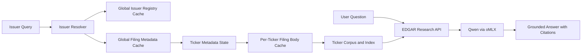

# EDGAR Tool Simplification and Cache Architecture Spec

Prepared 2026-04-26.

## Status

Proposed product and architecture spec for simplifying `Stock Intel > EDGAR Filings` and introducing a layered EDGAR cache that supports local filing intelligence without mirroring the full SEC corpus.

## Companion Document

This spec is intentionally paired with:

- `docs/edgar-qwen36-local-intelligence-architecture-spec.md`

Boundary between the two documents:

- this spec owns the user-facing EDGAR workflow, sync contract, cache policy, and filing acquisition strategy
- the Qwen/oMLX spec owns corpus extraction, indexing, retrieval, prompt construction, and local answer generation

They must be implemented together, but they solve different problems.

## Summary

The EDGAR tool should stop asking the user to think like a downloader.

The user-facing workflow should become:

1. specify the company
2. sync SEC filings
3. ask questions about those filings

The backend should decide:

- how the issuer is resolved
- which filing types matter by default
- what is cached globally
- what is cached per ticker
- when metadata is stale
- when raw filing bodies should be downloaded
- when the local filing index needs to be updated before asking the model

The target architecture is:

- global issuer registry cache
- global filing metadata cache across the universe
- per-ticker filing-body cache
- incremental refresh that only pulls new accession numbers since last seen
- optional background warming for watchlist or recently viewed issuers

This gives the app the performance advantages of a finite-universe cache without turning the product into a full local SEC mirror.

## Why This Spec Exists

The current EDGAR workspace exposes acquisition internals directly to the user:

- identifier mode selection
- freeform form-type entry
- file-save mode selection
- exhibit behavior
- resume mechanics
- language about company-site PDFs inside the EDGAR tool

That is too implementation-shaped for the core product experience.

The user should not need to decide:

- whether they want the primary filing file or all filing files
- whether exhibits are worth saving
- whether they should type `8-K, 10-K, 10-Q`
- whether EDGAR and company-site PDFs are part of one mental model

Those are backend orchestration concerns.

## Product Principles

### 1. Company First

The primary unit of interaction is the issuer, not the file bundle.

### 2. Smart Defaults

The app should choose a sensible filing coverage policy automatically.

### 3. Metadata Broad, Bodies Narrow

Universe-wide metadata is cheap enough to cache locally.
Universe-wide raw filing bodies are not the right default for a desktop app.

### 4. Local-First Intelligence

The EDGAR tool should feed the local corpus/index/model pipeline cleanly.
It should not expose model concerns or inference settings in the sync UI.

### 5. Incremental by Default

Every rerun should be a delta update whenever possible.

## Goals

- reduce the EDGAR sync UI to one primary user input: issuer identity
- remove downloader jargon from the default flow
- separate EDGAR from the company-PDF workflow in the UI and copy
- make SEC metadata globally cached and reusable across the app
- make raw filing downloads ticker-scoped and incremental
- ensure the EDGAR sync experience works as the acquisition layer for the Qwen/oMLX intelligence stack

## Non-Goals

This spec does not attempt to:

- mirror all raw EDGAR filing bodies for all issuers onto the local machine
- expose local model controls in the EDGAR sync form
- replace the raw filing downloader with an embeddings-first system
- define the chunking or prompt strategy in detail
- make every historical filing immediately available offline before the user ever asks for it

## Product Outcome

From the user’s point of view, `Stock Intel > EDGAR Filings` should feel like:

- "pick a company"
- "keep its SEC filing library current"
- "ask grounded questions about the company’s filings"

The user should not be managing:

- form lists
- file-save modes
- SEC internals versus primary docs
- exhibit toggles
- PDF acquisition language

## Simplified User Experience

## Primary Surface

The default EDGAR panel should contain:

- one issuer field that accepts ticker, company name, or CIK
- one primary action: `Sync SEC filings`
- one compact sync status area
- one compact readiness area for local filing Q and A
- one filing question box once the ticker has enough local corpus to answer questions

Suggested user-facing labels:

- field label: `Company`
- placeholder: `Ticker, company name, or CIK`
- primary button: `Sync SEC filings`
- post-sync button: `Refresh filings`
- question input label: `Ask about SEC filings`

## Removed From the Default UI

The default EDGAR experience should not show:

- identifier mode switch
- `Form types`
- `Files to save`
- `Include exhibits`
- `Checksum resume`
- any mention of company-site PDFs

## Advanced Controls

If advanced controls are kept at all, they should live behind an `Advanced` disclosure and be clearly described as exceptions to the normal workflow.

Allowed advanced controls in phase 2:

- force refresh
- custom date window
- custom form-type override
- include-exhibits override
- export/debug paths

Phase 1 recommendation:

- do not surface advanced controls in the EDGAR workspace
- keep them available only through backend compatibility routes or CLI-oriented tooling

## Default Filing Coverage Policy

If the user only specifies the company, the backend still needs a filing policy.

Recommended phase 1 policy:

- domestic issuers:
  - `10-K`
  - `10-Q`
  - `8-K`
- foreign/private issuers when applicable:
  - `20-F`
  - `40-F`
  - `6-K`

Optional phase 2 additions:

- `DEF 14A` for governance and compensation questions
- selected registration statements when they materially affect research workflows

Important rule:

- the user should not type these forms manually in the common case

## Smart Body Coverage Policy

The backend should separate metadata coverage from raw-body coverage.

### Metadata Coverage

For a resolved issuer:

- ingest the full available filing metadata history from the global metadata cache

### Raw Filing-Body Coverage

For a resolved issuer:

- download a smart working set of raw filing bodies for analysis

Recommended smart working set:

- the most recent `3` annual filings of the primary annual form
- the most recent `12` quarter-equivalent filings where applicable
- the most recent `24` months of current-report filings such as `8-K` or `6-K`
- any newer accession numbers discovered since the last ticker sync
- any older filings explicitly needed for a requested comparison or answer path

Why:

- this keeps the local corpus useful for research
- it prevents the default sync from ballooning on ticker histories with very large current-report volume
- it still allows deeper history to be hydrated on demand later

## UX Copy Rules

The EDGAR tool must describe the outcome, not the downloader mechanics.

Preferred copy direction:

- "Sync SEC filings for this company and keep the local filing library current."
- "Recent filing bodies are cached locally for analysis."
- "Older filings can be pulled in automatically when needed."

Prohibited copy direction:

- references to `PDFs` inside the EDGAR tool
- references to `all filing files + SEC internals`
- references to checksum manifests in the default UI
- references that force the user to choose file bundle granularity

## User Flows

## Flow 1: First-Time Sync

1. user enters issuer query
2. backend resolves issuer from the global issuer registry cache
3. backend ensures the global metadata cache is fresh enough
4. backend imports ticker metadata into the ticker workspace
5. backend downloads the smart working set of raw filing bodies
6. backend returns sync status and local readiness
7. backend queues or performs corpus/index build for filing Q and A

## Flow 2: Refresh Existing Ticker

1. user opens an existing ticker workspace
2. UI shows last metadata refresh, last body refresh, and last index refresh
3. user clicks `Refresh filings` or the app auto-refreshes in the background
4. backend checks for new accession numbers since last seen
5. backend downloads only missing filing bodies required by policy
6. backend reindexes only the new or changed filings

## Flow 3: Ask a Filing Question

1. user asks a question in the EDGAR workspace
2. backend checks whether the ticker metadata and local corpus are fresh enough
3. backend performs a lightweight incremental sync if new accession numbers are available
4. backend downloads any newly required raw filing bodies
5. backend updates the ticker’s filing corpus/index incrementally
6. backend retrieves filing chunks and calls the local Qwen model through oMLX
7. backend returns a grounded answer with citations

This question flow is expanded further in the companion intelligence spec and must stay aligned with it.

## Architecture Overview



## Cache Architecture

## 1. Global Issuer Registry Cache

Purpose:

- resolve ticker, company name, and CIK quickly and locally
- avoid repeated live issuer lookup work

Recommended source:

- SEC issuer registry data such as `company_tickers.json`

Recommended storage:

```text
[research root]/
  .sec/
    issuer-registry/
      company_tickers.json
      issuer-registry.sqlite3
      freshness.json
```

Recommended behavior:

- refresh at most once every `24` hours by default
- persist both the original source artifact and a normalized local lookup index
- support exact ticker, exact CIK, normalized company-name, and partial company-name resolution

## 2. Global Filing Metadata Cache Across the Universe

Purpose:

- keep the app aware of the filing universe without downloading all raw filing bodies
- make ticker refreshes cheap because new accession discovery is already local

Recommended source:

- the SEC nightly submissions bulk archive

Optional secondary source:

- the SEC company facts bulk archive for structured XBRL fact enrichment

Recommended storage:

```text
[research root]/
  .sec/
    filing-metadata/
      submissions.zip
      submissions.sqlite3
      companyfacts.zip
      companyfacts.sqlite3
      freshness.json
      import-jobs/
```

Recommended behavior:

- refresh on a nightly cadence
- check `Last-Modified` before pulling a new bulk artifact when possible
- store the compressed bulk archive plus a normalized local query store
- keep file-count low by importing into SQLite rather than exploding every JSON file into the filesystem

Important rule:

- this cache is universe-wide metadata only
- it is not permission to hydrate all raw filings for all issuers

## 3. Per-Ticker Filing-Body Cache

Purpose:

- preserve raw SEC artifacts for one issuer under the existing stock workspace layout
- provide stable source files for parsing, indexing, citation, and offline local Q and A

Recommended location:

```text
[research root]/
  stocks/
    [ticker]/
      [raw filing files]
      .edgar/
        metadata/
        exports/
        manifests/
        intelligence/
```

Rules:

- retain the current ticker-scoped filing storage shape
- keep raw filing bodies only for tickers the user has synced, warmed, or explicitly requested
- never treat the per-ticker cache as a disposable temporary store; it is the local source of truth for filing intelligence

## 4. Incremental Refresh Strategy

The app should think in terms of accession deltas.

Per ticker, track:

- `lastMetadataRefreshAt`
- `lastBodyRefreshAt`
- `lastIndexRefreshAt`
- `latestKnownAccession`
- `latestBodyCachedAccession`
- `latestIndexedAccession`

Refresh algorithm:

1. resolve issuer
2. consult the global metadata cache for that issuer
3. compare the issuer’s newest accession numbers against local ticker state
4. create a delta set of unseen accessions
5. apply the smart body-coverage policy to that delta set
6. download only the missing raw filing bodies
7. index only the newly added or changed local documents

## 5. Background Warming

Background warming is optional but useful.

Recommended warming targets:

- watchlist issuers
- recently viewed issuers
- recently asked-about issuers

Recommended warming order:

1. metadata refresh only
2. body-cache warming for the smart working set
3. background index build

Important constraint:

- warming should be opportunistic and bounded
- it should never silently escalate into downloading all filing bodies for all issuers

## Proposed Backend Responsibilities

## Public-Facing EDGAR Service

Keep the EDGAR service boundary in the backend, but split responsibilities more cleanly.

Recommended service split:

- `services/edgar_resolver.py`
  - issuer resolution through the global issuer registry cache
- `services/edgar_metadata_cache.py`
  - universe-wide metadata acquisition and normalization
- `services/edgar_sync.py`
  - ticker-scoped sync orchestration
- `services/edgar.py`
  - raw filing-body acquisition and artifact preservation
- `services/edgar_intelligence.py`
  - corpus/index orchestration for local filing Q and A

## API Contract

The default UI should move away from the current downloader-shaped contract.

Recommended public routes:

- `GET /api/sources/edgar/status`
- `POST /api/sources/edgar/sync`
- `GET /api/sources/edgar/workspace`
- `POST /api/sources/edgar/intelligence/ask`

Recommended `sync` request shape:

```json
{
  "issuerQuery": "NVIDIA",
  "outputDir": "/optional/research/root",
  "forceRefresh": false
}
```

Recommended `sync` response shape:

```json
{
  "issuerQuery": "NVIDIA",
  "resolvedTicker": "NVDA",
  "resolvedCompanyName": "NVIDIA CORP",
  "resolvedCik": "0001045810",
  "metadataState": {
    "status": "fresh",
    "lastRefreshedAt": "2026-04-26T20:00:00Z",
    "newAccessions": 2
  },
  "bodyCacheState": {
    "status": "updated",
    "downloadedFilings": 2,
    "skippedFilings": 18
  },
  "intelligenceState": {
    "status": "indexing",
    "lastIndexedAt": "2026-04-26T19:42:00Z"
  }
}
```

Backward-compatibility recommendation:

- keep the current downloader-shaped request model temporarily for CLI or advanced compatibility
- stop using it as the primary frontend contract

## Frontend Responsibilities

Primary owner:

- `frontend/src/components/EdgarWorkspace.tsx`

Supporting owners:

- `frontend/src/features/stock-intel/requests.ts`
- `frontend/src/lib/api/sources.ts`

Frontend responsibilities after simplification:

- capture a single issuer query
- submit sync and refresh actions
- display cache/index freshness
- allow question asking once filings are ready
- render answer citations returned by the backend

Frontend non-responsibilities:

- choosing form defaults
- deciding body-cache policy
- selecting individual artifact classes
- managing the oMLX runner directly

## Model and oMLX Compatibility

This EDGAR simplification spec must work cleanly with the selected local AI stack:

- local runner: `oMLX`
- generation model: `mlx-community/Qwen3.6-35B-A3B-4bit`
- fallback generation model: `mlx-community/Qwen3.5-27B-4bit`

Compatibility rules:

- the EDGAR sync layer prepares raw filing inputs for the intelligence layer
- the intelligence layer decides when corpus/index updates are required
- the frontend never talks to oMLX directly
- the user never selects model parameters from the EDGAR sync form

Product implication:

- `Sync SEC filings` is not the same thing as `Ask the model`
- sync prepares the local research substrate
- ask uses that substrate to retrieve chunks and call oMLX

## Coordination with the Intelligence Spec

Implementation contract between specs:

- this document owns when a ticker is considered synced and fresh enough to answer from
- the intelligence spec owns how the local corpus is parsed, indexed, retrieved, reranked, and answered
- if a question arrives when the corpus is stale, the backend may run a bounded incremental sync before retrieval
- the answer path must always end in grounded citations to local filing artifacts

## Rollout Plan

## Phase 1

- simplify the EDGAR UI to one issuer field and one sync action
- remove PDF language from the EDGAR tool
- remove downloader-granularity controls from the default UI
- add global issuer registry cache
- add global filing metadata cache
- keep ticker-scoped raw filing-body cache
- enable incremental accession-based refresh

## Phase 2

- add optional background warming for watchlist and recent issuers
- add explicit readiness/status UX for filing Q and A
- add on-demand deep-history body hydration when a question requires older filings

## Phase 3

- refine smart working-set policy from real usage data
- optionally add advanced overrides for power users without polluting the default workflow

## Acceptance Criteria

- a new user can sync a company’s SEC filings without selecting form types or file-save modes
- the EDGAR UI contains no references to company-site PDFs
- the backend can resolve issuer identity through a global local cache
- the backend can detect new accession numbers without live per-ticker discovery work every time
- raw filing-body downloads remain ticker-scoped rather than universe-wide
- a filing question can trigger a bounded incremental refresh and then flow into the local Qwen/oMLX answer path
- this spec and the companion intelligence spec describe one coherent end-to-end system
